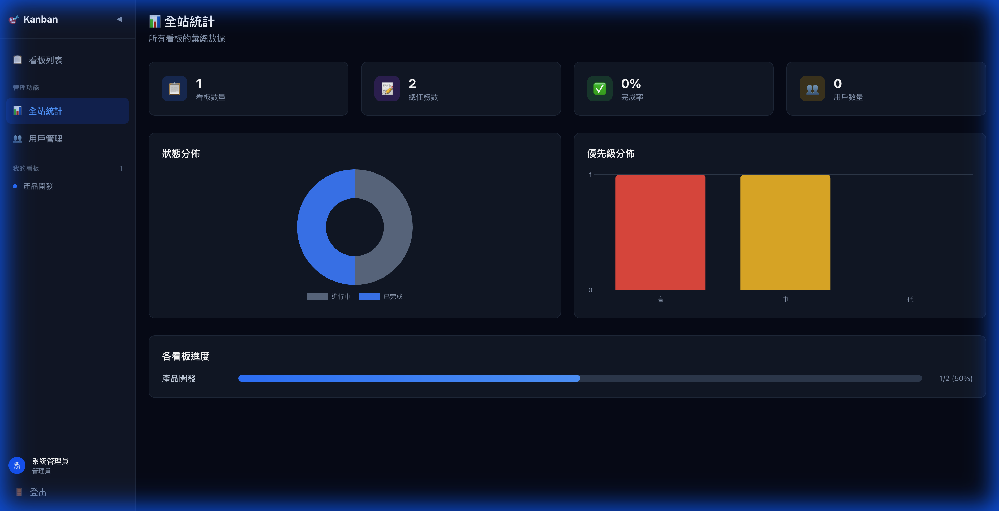
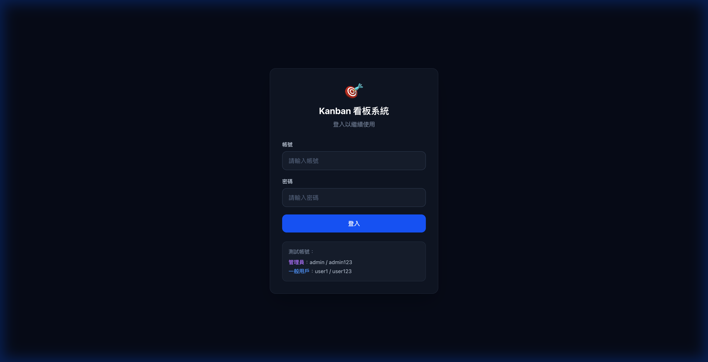
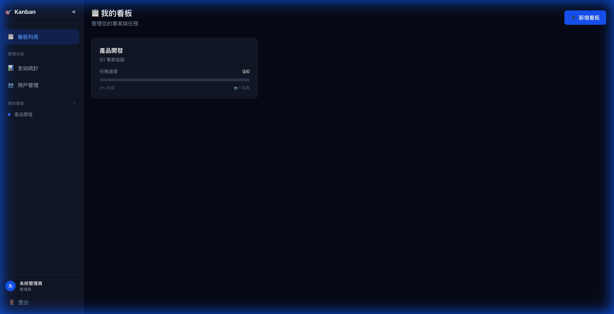
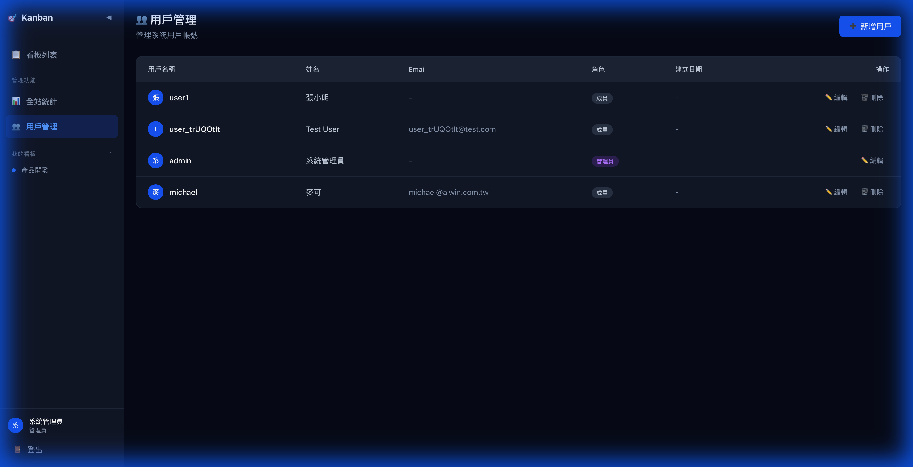

# Enterprise Kanban System (企業級看板管理系統)

一個現代化、高效率的專案管理工具，結合了美觀的 UI 與強大的後端 API。支援多看板管理、拖拉操作、任務排程、以及完整的後台統計與用戶管理功能。



## ✨ 特色功能

- **多看板管理 (Multi-board)**: 支援無限建立專案看板。
- **直覺拖拉 (Drag & Drop)**: 使用 Vue Draggable 打造的流暢卡片移動體驗。
- **任務管理**:
  - 優先級設定 (High/Medium/Low)。
  - **開始與截止日期 (Start/Due Date)**。
  - 任務描述與狀態追蹤。
- **管理員後台 (Admin Dashboard)**:
  - 可視化統計圖表 (Charts.js)。
  - 狀態分佈與優先級分析。
  - 用戶管理系統 (User Management)。
- **權限控制 (RBAC)**: 區分 Admin 與一般用戶權限。
- **響應式設計**: 手機、平板、桌面皆完美支援。

## 📸 系統截圖

### 1. 登入頁面


### 2. 看板列表


### 3. 看板細節 (任務拖拉)


### 4. 用戶管理 (Admin Only)


---

## 🛠️ 技術棧 (Tech Stack)

### Frontend
- **Framework**: Vue 3 (Composition API)
- **State Management**: Pinia
- **Styling**: Tailwind CSS
- **Components**: Chart.js, Vue Draggable, Headless UI

### Backend
- **Framework**: FastAPI (Python)
- **Database**: PostgreSQL (via Supabase) / SQLite (Dev)
- **ORM**: SQLAlchemy
- **Authentication**: JWT (JSON Web Tokens)

---

## 🚀 快速開始 (Getting Started)

### 1. 後端啟動 (Backend)

```bash
cd backend

# 安裝依賴 (建議使用 uv 或 venv)
uv sync   # 或 pip install -r requirements.txt

# 執行遷移 (若有需要)
uv run migrate.py  # 初始化資料庫
uv run migrate_dates.py 

# 啟動 Server
uv run uvicorn app.main:app --reload
```

後端預設運行於 `http://127.0.0.1:8000`。
Docs: `http://127.0.0.1:8000/docs`

### 2. 前端啟動 (Frontend)

```bash
cd frontend

# 安裝依賴
npm install

# 啟動開發伺服器
npm run dev
```

前端預設運行於 `http://localhost:5173`。

### 3. 預設帳號

- **Admin**: `admin` / `password123`
- **User**: (請至後台自行建立)

---

## 📂 專案結構

```
kanban/
├── backend/            # FastAPI 後端
│   ├── app/
│   │   ├── routers/    # API 路由
│   │   ├── models.py   # DB 模型
│   │   └── crud.py     # 資料庫操作
│   └── migrate.py      # 遷移腳本
│
├── frontend/           # Vue 3 前端
│   ├── src/
│   │   ├── components/ # 通用組件
│   │   ├── stores/     # Pinia 狀態管理
│   │   ├── views/      # 頁面 (Pages)
│   │   └── api.js      # API 封裝
│   └── docs/           # 開發文件與規格書
│
└── screenshots/        # 系統截圖
```

## 📝 License

MIT
